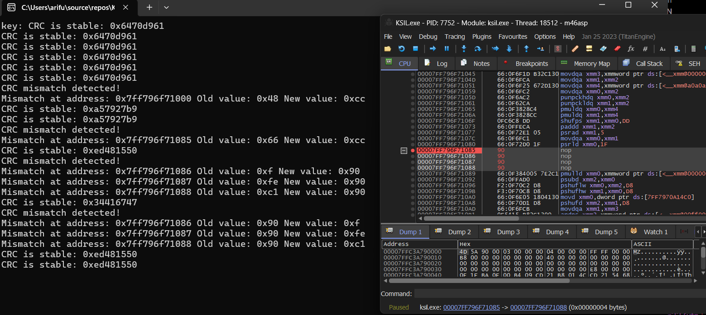
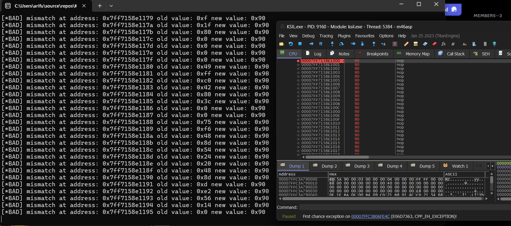

# CRC-Integrity Checks.
an multipurposed CRC aka integrity check made in C++.
## Small information
i've made the hacked address logging myself.
you can add and improve it according to your needs.
# Pictures from it


## Example usage of it.0 (ig_check.hpp)
```
#include <windows.h>
#include <iostream>
#include <thread>
#include <atomic>
#include "ig_check.hpp"
std::atomic<bool> loop{ true };
int main() {
    initialize_crc_table();
    std::thread crc(crc_check, std::ref(loop));
    std::cin.get();
    return 0;
}
```
